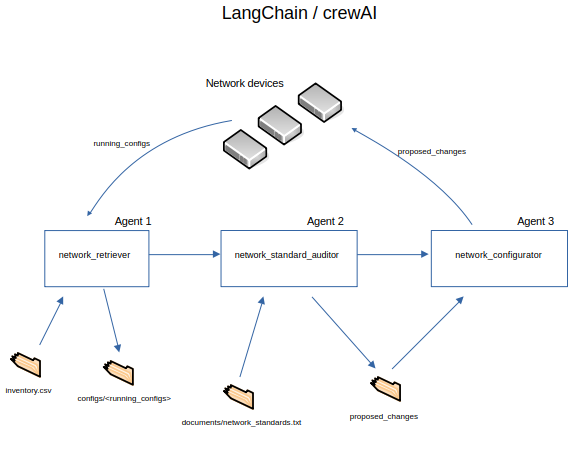

# Network Compliance crew of agents using crewAI and LangChain.
Use LLMs to make the network observe Network Architecture Standards, using an agentic approach.

Proposed one solution based on LangChain and another based on crewAI. Both solutions rely on the capability of LLMs to interpret what we need in natural language, and take apropriate actions like make SSH connections and generate CLI commands to remediate non-compliances.

The solution based on crewAI is the most agentic one, as all instructions are given on natural language, with the exception of the custom tools necessary to make SSH connections.

LLMs are able to compare running configurations to desired Network Standards documents, and generate remediation configuration to comply with such Standards.



Using built-in actions to read and write files, and custom tools to connect to remote devices and retrieve information or send configuration commands.

* Agent1: retrieves the running configuration of all the devices in 'network_inventory.csv'. They are stored in the folder 'configs', which will be created if needed.
* Agent2: audits those configurations to the Network Architecture Standard document stored in 'documents/network_standards.txt'. Then, it generates the changes to apply to all devices in order to make them compliant. Those changes are stored in the file 'proposed_changes'.
* Agent3: reads 'proposed_changes' and implements them into the devices.


## Install 
Make a virtual environment and install the requirements.txt 

```console 
python3 -m venv COMPLIANCE_AGENT
source COMPLIANCE_AGENT/bin/activate 
pip install -r requirements.txt
```
Using Python 3.12.


## Usage 

Modify the Network Architecture Standards document 'documents/network_standards.txt' as desired.
Modify the file 'network_inventory.csv' to include your own devices.

To use LangChain solution:
```console 
python agentic_network_compliance_crewAI
```

To use crewAI solution:
```console 
python gentic_network_compliance_langchain
```

Using GPT-4o for best reasoning. GTP-4o is often capable of self-correction when an action has not been planned properly.


### It is not ready for production, but it shows the potential.
LLMs can be slow when processing long text, e.g. full running configurations. In such case, you can modify the code to execute one agent at a time.


